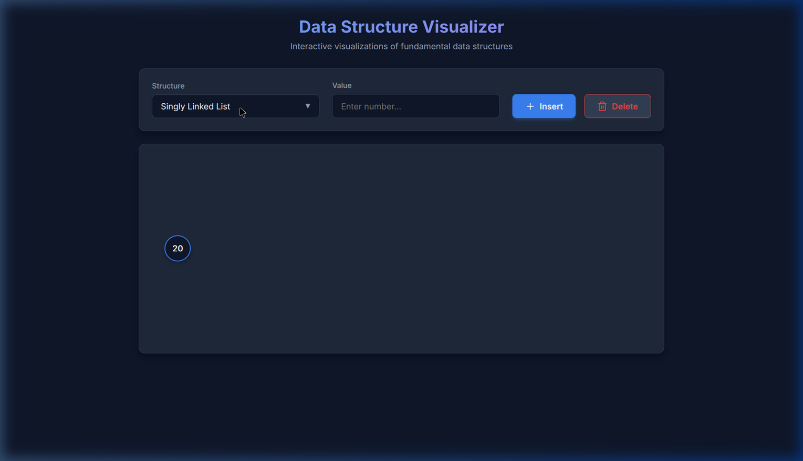

# Data Structures Visualizer

A clean, beginner-friendly, and interactive Data Structures Visualizer built strictly with vanilla HTML, CSS, and JavaScript. 



## Features
- **6 Supported Data Structures**:
  - Stack
  - Queue
  - Priority Queue (Ascending order)
  - Double-Ended Queue (Deque)
  - Singly & Doubly Linked Lists
  - Binary Search Tree & AVL Tree 
- **Operations:** Insert and Delete functionality with smooth step-by-step CSS animations.
- **Smart Panning & Zooming:** Navigate massive Binary Search Trees seamlessly via click-and-drag panning and scroll-wheel zooming within the canvas!
- **Themes:** Fully responsive and seamlessly toggles between Light and Dark mode.

## How to Start / Run Locally

Since this project has zero external dependencies or package managers, running it is incredibly simple!

### Option 1: Live Server (Recommended)
If you have Python installed, you can serve the directory seamlessly:
1. Open your terminal.
2. Navigate to the project folder.
3. Run the following command:
   ```bash
   python3 -m http.server 8080
   ```
4. Open your browser and visit `http://localhost:8080`.

### Option 2: Direct File Open
You can directly double-click the `index.html` file in your file explorer, and your default web browser will open it. Everything will run client-side perfectly!

## Code Structure
- `index.html`: The main structured layout.
- `style.css`: Responsive, manual styling with static layout logic (no advanced CSS variables used).
- `utils.js`: Shared helpers and DOM elements.
- `main.js`: Core event listeners and scaling logic.
- `{data_structure}.js`: Individual files separating the logic for each data structure to maximize readability.
