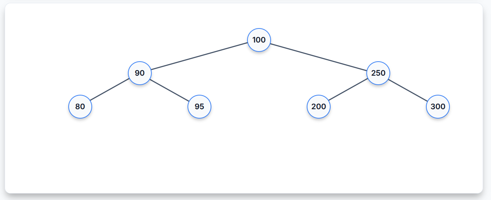

<div align="center">

# 🧱 Data Structures Visualizer

### _Watch data structures come alive_

<br>

[](https://developer.mozilla.org/en-US/docs/Web/HTML)
[](https://developer.mozilla.org/en-US/docs/Web/CSS)
[](https://developer.mozilla.org/en-US/docs/Web/JavaScript)

<br>

A clean, interactive web app to **visualize fundamental data structures** with smooth step-by-step CSS animations, pan & zoom navigation, and dark/light theme support — built entirely with vanilla HTML, CSS, and JavaScript.

<br>

---

</div>

<br>



<br>

## 🎯 Supported Data Structures

<table>
<tr>
<td width="50%">

### 📚 Linear Structures

| Structure | Operations | Behavior |
|---|:---:|---|
| **Stack** | Push / Pop | LIFO — Last In, First Out |
| **Queue** | Enqueue / Dequeue | FIFO — First In, First Out |
| **Priority Queue** | Insert / Delete | Sorted by priority (ascending) |
| **Deque** | Insert/Delete Front & Rear | Double-ended access |

</td>
<td width="50%">

### 🔗 Node-Based Structures

| Structure | Operations | Behavior |
|---|:---:|---|
| **Singly Linked List** | Insert / Delete by value | Forward traversal only |
| **Doubly Linked List** | Insert / Delete by value | Bi-directional traversal |
| **Binary Search Tree** | Insert / Delete by value | Ordered binary tree |
| **AVL Tree** | Insert / Delete by value | Self-balancing BST |

</td>
</tr>
</table>

<br>

## ✨ Key Features

- 🎬 **Step-by-Step Animations** — Watch every insert and delete operation play out with smooth CSS transitions
- 🔍 **Pan & Zoom** — Click-and-drag to pan, scroll-wheel to zoom — navigate massive trees effortlessly
- 🌗 **Dark / Light Theme** — One-click toggle between dark and light modes
- 📱 **Fully Responsive** — Works great on desktop and tablets
- 🧮 **8 Data Structures** — From simple stacks to self-balancing AVL trees
- 🚫 **Zero Dependencies** — No npm, no build tools, no frameworks — pure vanilla

<br>

## 🚀 Quick Start

```bash
# Clone it
git clone https://github.com/punitxdev/Data-Structures-Visualizer.git
cd Data-Structures-Visualizer

# Run it (pick one)
open index.html                    # macOS
xdg-open index.html                # Linux
python3 -m http.server 8080        # Any OS → localhost:8080
```

> **No install. No build. Just open and start visualizing.**

<br>

## 📁 Project Structure

```
📦 Data-Structures-Visualizer
 ┣ 📄 index.html          → Page layout with controls & canvas
 ┣ 🎨 style.css           → Full styling, themes, animations & layouts
 ┣ 🔧 utils.js            → Shared DOM helpers & utility functions
 ┣ 🔗 main.js             → Core event listeners, pan/zoom & initialization
 ┣ 📚 stack.js            → Stack (LIFO) implementation
 ┣ 📚 queue.js            → Queue (FIFO) implementation
 ┣ 📚 priority-queue.js   → Priority Queue (sorted insert)
 ┣ 📚 deque.js            → Double-Ended Queue (front/rear ops)
 ┣ 📚 linked-list.js      → Singly & Doubly Linked List
 ┣ 🌳 tree.js             → BST & AVL Tree with auto-balancing
 ┗ 📝 README.md
```

<br>

## 🛠️ Built With

| Tech | Purpose |
|---|---|
| **HTML5** | Semantic page structure |
| **CSS3** | Animations, transitions, dark/light themes, Flexbox layouts |
| **Vanilla JS** | Async animations, DOM manipulation, data structure logic |
| **Google Fonts** | Inter typeface |

<br>

## 🤝 Contributing

Contributions, issues, and feature requests are welcome!

```bash
# Fork → Branch → Commit → Push → PR
git checkout -b feature/new-structure
git commit -m "Add heap visualization"
git push origin feature/new-structure
```

<br>

## 📄 License

Open source under the [MIT License](LICENSE).

<br>

<div align="center">

---

**Made with ❤️ by [punitxdev](https://github.com/punitxdev)**

_If you found this useful, give it a ⭐!_

</div>
